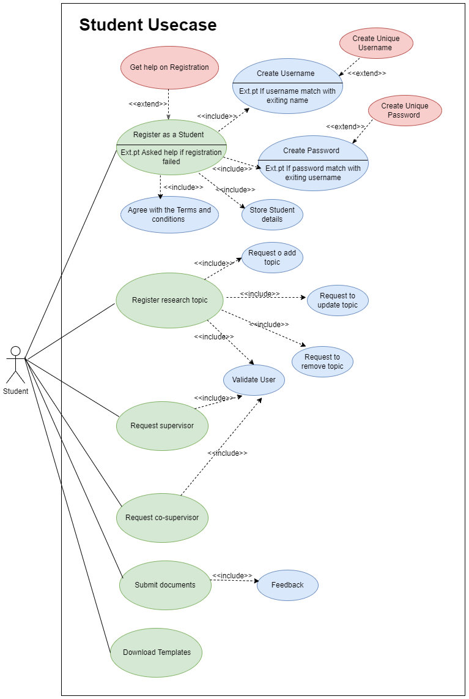

<!-- PROJECT LOGO -->
 

  

  <h3 align="center">Research Project Management Tool </h3>

  

    <a href="https://www.sliit.lk/"><strong>Sri Lanka Institute of Information Technology</strong></a>
     
    Application Framework - SE3040
     
     
    <a href="#">Assignment 02 </a>
     
    Group Project
          
  

<!-- ABOUT THE PROJECT -->
### Project Discription
All SLIIT undergraduates must do a research project in their 4th year. This Research Project 
module is a 16 credit, two semesters long project. A student group must find a research topic in 
a specific research field and send it to a supervisor who has interests in the same research field. 
Once the supervisor accepted the topic, they must find a co-supervisor of the same research 
interest.
After finalizing the supervisor student must send a document including the topic details of the 
Research. Then topic evaluation panel will evaluate the topic and send feedback to the student 
group. If the topic is accepted, they can continue to do the project. If rejected, they must find a 
new topic and submit it back.
There are several evaluation stages. Document submissions are evaluated by the supervisor or 
the co-supervisor. Presentations will be evaluated by a separate panel. The final Thesis will be 
Double evaluated by the supervisor and a blind reviewer.
SLIIT Research project team is looking for a system, which has the capability of managing the 
Research project and automating certain tasks.

### User Characteristics

##### Admin
- Delete/Update users
- Create submission types
- Allocate panel members to student groups
- Create marking schemes
- Upload document/presentation templates
- View Roles

##### Student
- Register
- Create student groups
- Register research topic
- Request supervisor
- Request co-supervisor
- Submit documents
- Download Templates

##### Staff
- Register

##### Supervisor / Co-Supervisor
- Should be a staff member
- Accept topics
- Chat with the groups
- Evaluate Documents submitted by groups using the provided marking scheme

##### Panel Member
- Should be a staff member
- Admin will add them to a panel
- Evaluate topics
- Evaluate students’ presentations according to the provided marking scheme

## Student usecase diagram
 
 
<!-- TECHNOLOGY -->
## Technology Stack

 | No. | Technology           | Description                                       |
| --- | --------------------| ------------------------------------------------- |
| 1.  | ReactJS              | A JavaScript library for building user interfaces |
| 2.  | NodeJS               | A JavaScript runtime environment                 |
| 3.  | ExpressJS   | Web application frameworks for Node.js           |
| 4.  | JSON based Web Services | Lightweight, data interchange format             |
| 5.  | NoSQL Database (MongoDB) | A flexible and scalable document database      |
| 6.  | JEST                 | A JavaScript testing framework     

 
<!-- ACKNOWLEDGMENTS -->

## Acknowledgment
🚀 Thank all SLIIT Lectures and who helps to develope and understand this Architecture

(<a href="#top">back to top</a>)

